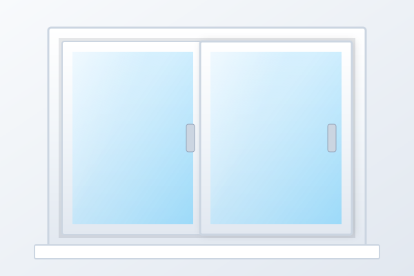

# Esquadrias de Alumínio - Site Institucional & Vitrine Comercial

Site profissional, moderno, rápido e responsivo para empresa de esquadrias de alumínio, focado em alta conversão de orçamentos, exibição de catálogo de produtos, promoções com desconto e contato direto via WhatsApp.

---

## 📁 Estrutura de Arquivos do Projeto

O projeto foi construído em **HTML5 Semântico**, **CSS3 Moderno** e **JavaScript Vanilla**, sem frameworks pesados, funcionando de forma autônoma:

```text
/esquadrias-site
│
├── index.html                  # Estrutura semântica, SEO, dados estruturados Schema.org
├── css/
│   └── style.css              # Variáveis CSS, layout responsivo mobile-first e acessibilidade
├── js/
│   └── script.js              # Objeto CONFIG editável, menu mobile, FAQ acordeão e formulário
├── img/
│   ├── produtos/              # Imagens dos modelos de esquadrias
│   │   ├── janela-aluminio.svg
│   │   ├── porta-aluminio.svg
│   │   ├── janela-correr.svg
│   │   ├── porta-balcao.svg
│   │   ├── maxim-ar.svg
│   │   └── sob-medida.svg
│   ├── banners/               # Imagens do Hero e chamadas
│   │   ├── hero-banner.svg
│   │   └── cta-banner.svg
│   └── empresa/               # Imagens institucionais
│       ├── fabrica.svg
│       ├── equipe.svg
│       └── instalacao.svg
└── README.md                  # Manual completo de personalização
```

---

## 🚀 Como Executar Localmente

1. Basta dar um duplo clique no arquivo **`index.html`** em qualquer computador (Windows, Mac ou Linux).
2. O site abrirá diretamente no navegador (Chrome, Edge, Firefox, Safari) com todas as funções interativas ativas (menu mobile, formulário, acordeão, botões de WhatsApp).
3. Não requer instalação de Node.js ou servidores locais para funcionar.

---

## ⚙️ Como Personalizar os Dados da Empresa

Abra o arquivo **`js/script.js`**. Logo no início do arquivo você encontrará a constante **`CONFIG`**:

```javascript
const CONFIG = {
  empresa: "Alumínio & Esquadrias",               // Nome que aparecerá no cabeçalho e rodapé
  slogan: "Soluções em Esquadrias de Alto Padrão",
  whatsapp: "5511999999999",                      // Somente números: 55 + DDD + Telefone
  telefone: "(11) 99999-9999",                    // Número formatado para exibição visual
  email: "contato@empresa.com",                   // Seu e-mail de contato
  instagram: "https://instagram.com/suaempresa",  // Link do seu Instagram
  facebook: "https://facebook.com/suaempresa",    // Link do seu Facebook
  endereco: "Av. Industrial das Esquadrias, 1000",
  cidade: "São Paulo - SP",
  horario: "Segunda a Sexta: 08h às 18h | Sábados: 08h às 12h"
};
```

> **Atenção:** Ao trocar o valor de `whatsapp` em `CONFIG`, todos os botões flutuantes, links de contato e botões de ofertas do site serão atualizados automaticamente!

---

## 🖼️ Como Substituir as Imagens

As imagens fornecidas vêm em formato vetorial SVG leve de alta nitidez. Para usar suas próprias fotos reais (JPG, PNG ou WebP):

1. Salve suas fotos nas respectivas pastas dentro de `img/`:
   - `img/produtos/janela-aluminio.jpg`
   - `img/produtos/porta-aluminio.jpg`
   - `img/banners/hero-banner.jpg`
   - `img/empresa/fabrica.jpg`
2. No arquivo **`index.html`**, localize a tag `` correspondente e altere a extensão no atributo `src`:
   ```html
   <!-- Antes -->
   

   <!-- Depois -->
   
   ```

---

## 🏷️ Como Alterar Preços e Produtos em Oferta

No arquivo **`index.html`**, procure pela seção com o ID `ofertas`:

```html
<h3 class="offer-title">Janela de Alumínio 1,20 x 1,00 m</h3>
<div class="offer-old-price">De R$ 699,90</div>
<div class="offer-new-price">R$ 549,90</div>
<button
  type="button"
  class="btn btn-whatsapp btn-offer-interest"
  data-offer-title="Janela de Alumínio 1,20 x 1,00 m"
  data-offer-price="R$ 549,90">
  Tenho interesse
</button>
```
Basta alterar os textos visuais e os atributos `data-offer-title` e `data-offer-price` para que o WhatsApp receba a mensagem com o valor exato da promoção.

---

## 📱 Recursos e Boas Práticas Implementadas

- **Mobile-First:** Perfeito em telas de 320px até monitores 4K ultrawide.
- **WhatsApp Integrado:** Botão flutuante sempre visível com mensagem inicial amigável.
- **Formulário com Validação em Tempo Real:** Valida campos essenciais e formata o telefone automaticamente.
- **SEO & Social Share:** Meta tags OpenGraph, Twitter Cards e dados estruturados Schema.org (JSON-LD) prontos para mecanismos de busca.
- **Acessibilidade (a11y):** Ícones SVG acessíveis, suporte a navegação por teclado (`:focus-visible`), atributo `aria-expanded` no menu e FAQ, e respeito a `prefers-reduced-motion`.
